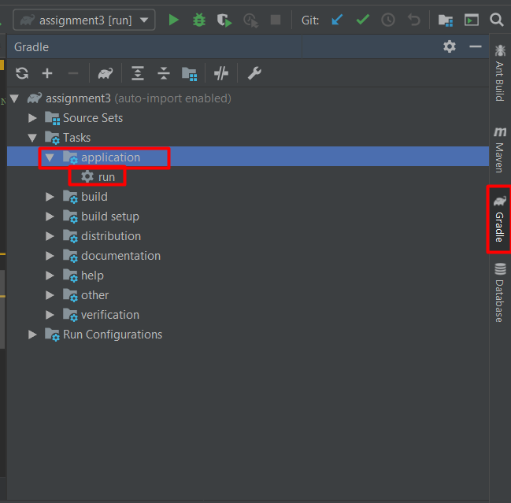

# Assignment 3

## Introduction

In this assignment you will have the opportunity to work with JavaFx.
Your task is to create a GUI for a simple game of Sudoku.
As you can see, looking at the project structure, you already have a part of the program.

### You are provided with:

- logical part of the Sudoku game.

### You need to:

- create the GUI for the game using JavaFx.

### Requirements:

- Create a working GUI, where it's possible to display the Sudoku game grid and fill in the missing numbers with mouse/keyboard or other method.
- You can also add more scenes, like a scene for choosing the difficulty. The difficulty of the puzzle depends on the number of digits a player has to fill in - this number is a parameter to the Sudoku class constructor.
- You must have buttons for automatically solving the puzzle automatically, checking the puzzle and generating a new puzzle.
- You could also provide a timer.
- When entering the result in each of the boxes, offer the possibility to press Enter key in order to check if the answer is the correct one and signal it in a proper way (for example, make the background of the box red for 1 second in case of a wrong answer)

### How to set up

1. To start with this assignment:

    a) Download the zipped project and open it, or:

    b) Clone the repository and open the cloned project

2. You will see a Gradle project setup screen, just click OK and wait patiently (this can take several minutes).

3. Go to the Gradle tab on the right side of the IDE, there you need to search for `Tasks` > `application` > `run`. Double click the taks to run the application.
You may encounter problems if Java JDK is not set to version 11 in the Project Structure, or if you do not have Gradle installed.
By default the application presents a text user interface.

 

3. Start creating your GUI (your code resides in src/main/java/java2.saxion)

## Good Luck!

The **start creating your GUI** might seem a bit difficult at first, so here's how to do it:

1. Add a new fxml file to your project (this is going to be your window) [e.g. MainWindow.fxml]
2. Add a new Java class to your project - this will be the controller, so name it appropriately [e.g. Controller.java]
3. In your fxml file you have to set up the connection between the view and the controller, as well as put some layout control. 
    For instance to set up a simple grid layout, write the following in your fxml:
    
    ~~~xml
    <GridPane fx:controller="java2.saxion.Controller"
              xmlns:fx="http://javafx.com/fxml" alignment="center" hgap="10" vgap="10">
    </GridPane>
    ~~~
4. Add another class to your project that will launch the GUI application (or just change the existing Main.java).
    The content of this new main class can look like this:
    
    ~~~java
    public class MainGUI extends Application {
    
        @Override
        public void start(Stage primaryStage) throws Exception{
    
            FXMLLoader loader = new FXMLLoader(getClass().getResource("MainWindow.fxml"));
            Parent root = loader.load();
    
            var controller = (Controller)loader.getController();
            var sudoku = new Sudoku(9, 10 );
         
            // TODO: bind the model to the controller here
    
    
            primaryStage.setTitle("Sudoku");
            primaryStage.setScene(new Scene(root, 400, 450));
            primaryStage.show();
        }
    
    
        public static void main(String[] args) {
            launch(args);
        }
    }
    ~~~
    
    Pay attention that the name of the fxml file and the controller class are correct!
    If you added a new class (e.g. MainWithGui.java) instead of modifying your old Main.java file you should also change the corresponding setting in the `build.gradle` file:
    
    ~~~text
    mainClassName = 'java2.saxion.MainWithGui'
    ~~~    
   

## Gradle Tutorial
I recommend this one: https://www.youtube.com/watch?v=nKIMGH0l3Wo
